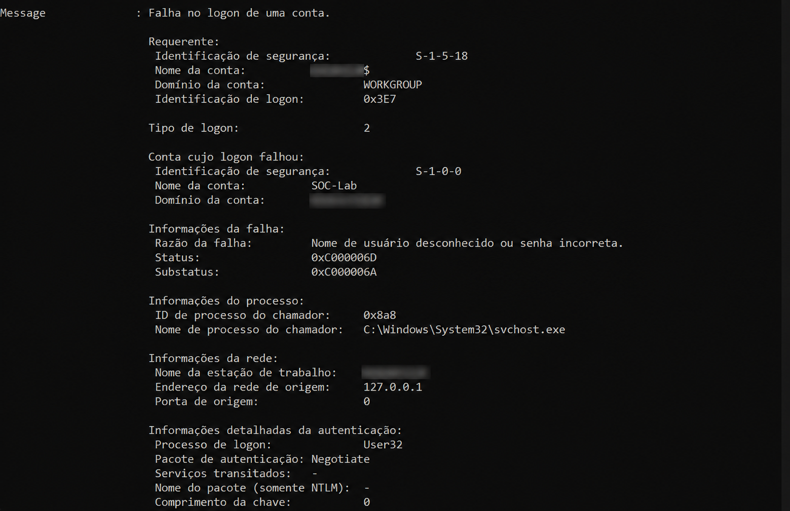
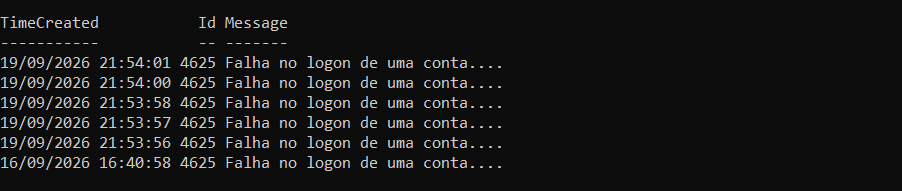

# 🔐 SOC - Brute Force Investigation

## 📌 Sobre o projeto

Este projeto tem como objetivo investigar tentativas de autenticação
malsucedidas em um ambiente Windows, utilizando os logs de segurança
do sistema para identificar possíveis indicadores de um ataque de
brute force.

## 🎯 Objetivos

- Identificar tentativas de login mal-sucedidas;
- Analisar eventos de segurança do Windows;
- Investigar o Event ID 4625;
- Identificar possíveis indicadores de comprometimento (IoCs);
- Documentar o processo de investigação;
- Desenvolver habilidades relacionadas à análise de incidentes em um SOC.

## 🛠️ Tecnologias e ferramentas

- Windows
- Windows Event Viewer
- Windows Security Logs
- GitHub

## 🔎 Investigação

A investigação foi realizada em um ambiente Windows controlado, utilizando uma conta local criada especificamente para o laboratório.

Para simular um possível cenário de brute force, foram realizadas múltiplas tentativas de autenticação utilizando uma senha incorreta.

Após as tentativas, os logs de segurança do Windows foram analisados através do PowerShell e do Windows Event Viewer.

### 🚨 Detecção

Durante a análise foram identificados cinco eventos de falha de autenticação em um intervalo de aproximadamente cinco segundos.

Todos os eventos encontrados possuíam o **Event ID 4625**, utilizado pelo Windows para registrar falhas de logon.

Os eventos ocorreram nos seguintes horários:

- 21:53:56
- 21:53:57
- 21:53:58
- 21:54:00
- 21:54:01

A ocorrência de várias falhas de autenticação em um curto intervalo de tempo pode ser um indicador de tentativa de brute force e deve ser investigada.

### 📊 Análise do evento

Um dos eventos 4625 foi analisado detalhadamente.

| Campo | Valor |
|---|---|
| Event ID | 4625 |
| Conta alvo | SOC-Lab |
| Tipo de Logon | 2 |
| Status | 0xC000006D |
| Substatus | 0xC000006A |
| Endereço de origem | 127.0.0.1 |
| Processo de Logon | User32 |
| Pacote de autenticação | Negotiate |

O **Logon Type 2** representa uma tentativa de logon interativo.

O código **0xC000006D** indica uma falha de autenticação, enquanto o substatus **0xC000006A** indica que uma senha incorreta foi utilizada.

O endereço **127.0.0.1** indica que, neste laboratório, as tentativas foram originadas na própria máquina.

### 🖼️ Evidências

#### Evento 4625 — detalhes da falha de autenticação

A análise do evento permitiu identificar a conta alvo, o tipo de logon, os códigos de status e a origem da tentativa.

#### Múltiplas tentativas de autenticação

Foram identificados cinco eventos 4625 em aproximadamente cinco segundos, demonstrando múltiplas falhas consecutivas de autenticação.

### 📝 Conclusão

A análise identificou cinco falhas consecutivas de autenticação contra a conta `SOC-Lab` em um curto intervalo de tempo.

Em um ambiente real de SOC, esse comportamento justificaria uma investigação para determinar se as tentativas foram causadas por erro legítimo do usuário, processo automatizado ou possível ataque de brute force.

Neste laboratório, as tentativas foram geradas propositalmente em ambiente controlado para demonstrar a identificação e análise de eventos de autenticação do Windows.

## 🧠 Aprendizados

Este projeto busca desenvolver conhecimentos práticos em:

- Análise de logs;
- Monitoramento de eventos de segurança;
- Investigação de autenticação;
- Identificação de possíveis ataques de brute force;
- Documentação de incidentes.

---

**Projeto desenvolvido para fins educacionais e de laboratório.**
